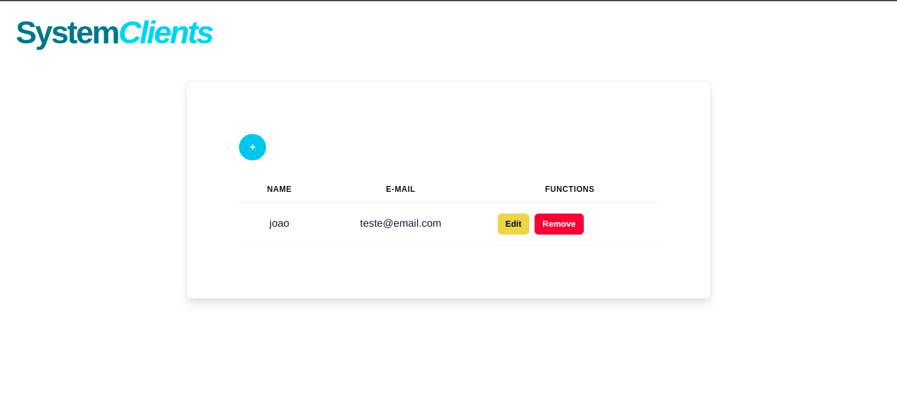

# System Clients Fullstack

<p>
  🇺🇸 System Clients made with NextJS, JavaScript, Mongodb and Chakra-ui.
</p>

<p>
  🇺🇸 If you want to use the system in a particular mongo, follow the examples in `.env.example` or .ENV below.
</p>

<br/>

<p>
  🇧🇷 Sistema de Clients feito com NextJS, JavaScript, Mongodb e Chakra-ui.
</p>

<p>
  🇧🇷 Se você quiser usar o sistema em um mongo particular, siga os exemplos da `.env.example` ou nas .ENV logo abaixo.
</p>

# 🇧🇷 A aplicação está on-line no link | 🇺🇸 The application is online at the link:


```

```

## 🇺🇸 If you want to analyze the project on your machine, follow this step by step. 🇧🇷 Caso você queira analisar o projeto em sua máquina, siga este passo a passo: 😁

<br>

## 🇺🇸 ENG

### Clone😎

```
git clone https://github.com/jovimoura/system-clients
```

### Access the folder🤓

```
cd <folder>
```
### Install dependencies🤠
```
npm install
```
### Start application🤩
```
npm run dev
```
### default port:🤗

```
http://localhost:3000/
```

<br>

## 🇧🇷 PT-BR

### Clone o repositório😎

```
git clone https://github.com/jovimoura/system-clients
```

### Acesse o diretorio🤓

```
cd <nome-da-pasta>
```
### Instale as dependências🤠
```
npm install
```
### Inicie a aplicação🤩
```
npm run dev
```
### A aplicação, por padrão, fica na porta:🤗

```
http://localhost:3000/
```

# .ENV

```
DB_URL=
DEV_URL=
PROD_URL=
```

## 🇺🇸 Image | 🇧🇷 Imagem do projeto  💻




##  🇺🇸 Tecnologies and Libs | 🇧🇷 Tecnologias e Bibliotecas utilizadas🦉

<ul>
    <li>NextJS</li>
    <li>JavaScript</li>
    <li>Mongodb</li>
    <li>Chakra-ui</li>
</ul>

##  🇧🇷 Feito por | 🇺🇸 Made by:

### João Victor dos Santos Moura
### E-mail: joaovictors.mouraa@gmail.com
### Linkedin: https://www.linkedin.com/in/jovimoura10/
